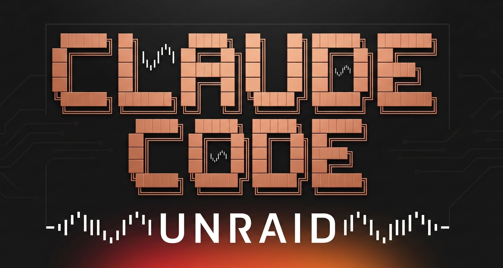

# Claude Code Remote Control Unraid Plugin

[Leer en español](README.es.md)



Installs [Claude Code](https://github.com/anthropics/claude-code) CLI on Unraid.

This is a fork of [brianpugh/unraid-claude-code](https://github.com/brianpugh/unraid-claude-code), all credit for the original plugin goes to its author. This fork fixes a reliability bug: a failed network fetch of the plugin icon right after a reboot could permanently disable the plugin (Unraid would move it to `/boot/config/plugins-error` and never retry it automatically). See [CHANGES](#changes) below.

## Install

```bash
plugin install https://raw.githubusercontent.com/Nebur692/claude-code-remote-control-unraid-plugin/main/claude-code.plg
```

## Usage

Open the Unraid terminal and run:

```bash
claude
```

Authentication and settings persist across reboots automatically. Configure the appdata path via **Settings > Utilities > Claude Code**.

## Requirements

- Unraid 6.12.0+
- Array started, or appdata on an [Unassigned Devices](https://forums.unraid.net/topic/92462-unassigned-devices/) mount
- Internet connection (first install only)

## Changes

- **v1.0.0** — Forked from upstream. The plugin icon is now embedded as inline base64 instead of being fetched over the network at boot. Previously, if that single download failed (e.g. network not ready yet right after a reboot), Unraid would abort and permanently banish the whole plugin to `/boot/config/plugins-error`, silently disabling it on every future boot until manually reinstalled.

## Troubleshooting

Check the install log:

```bash
cat /var/log/claude-code-install.log
```

Manually re-run the installer:

```bash
/usr/local/emhttp/plugins/claude-code/scripts/install-claude.sh
```

If the plugin ever stops loading after a reboot, check whether it landed in `/boot/config/plugins-error/claude-code.plg` — if so, reinstall it from **Plugins** in the Unraid web UI using the install URL above.

## Development

```bash
# Serve plugin locally
cd /path/to/claude-code-remote-control-unraid-plugin
python3 -m http.server 8080

# On Unraid terminal - install
plugin install http://YOUR_DEV_IP:8080/claude-code.plg

# Reinstall after changes
plugin remove claude-code.plg && plugin install http://YOUR_DEV_IP:8080/claude-code.plg
```

### Releasing

This plugin uses date-based versioning (`YYYY.MM.DD`) per Unraid plugin conventions, tracked separately from git release tags.

```bash
# Update version to today's date, commit, and tag
bump-my-version replace --new-version 2025.12.01

# Push with tags
git push && git push --tags
```

The release updates version strings in `claude-code.plg` automatically via `.bumpversion.toml`.
